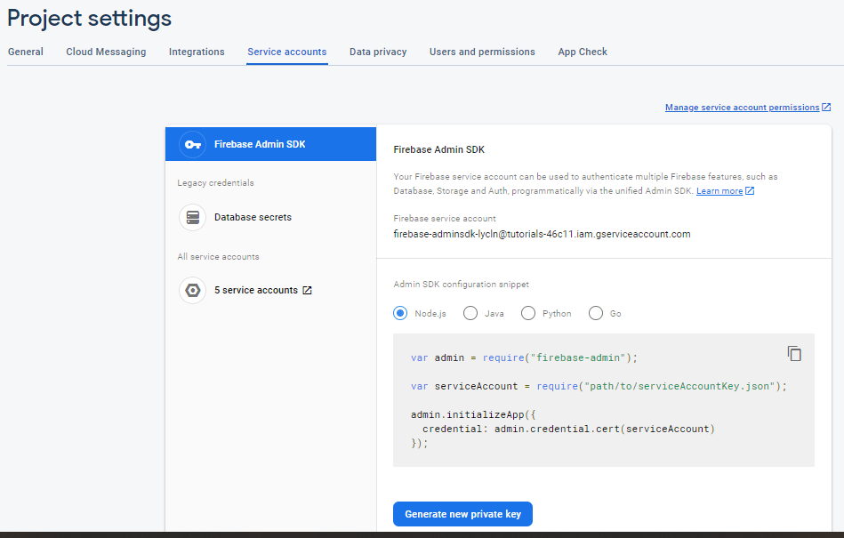
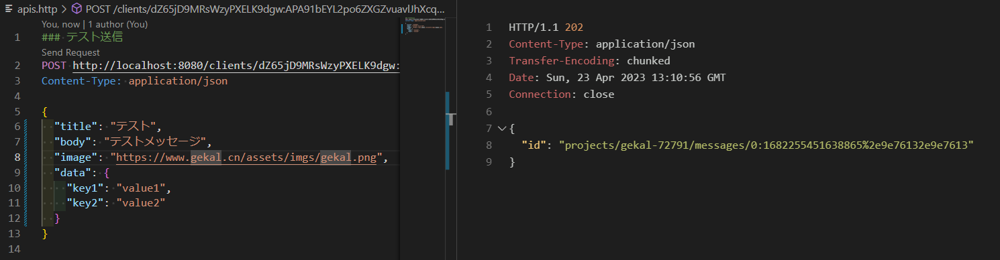
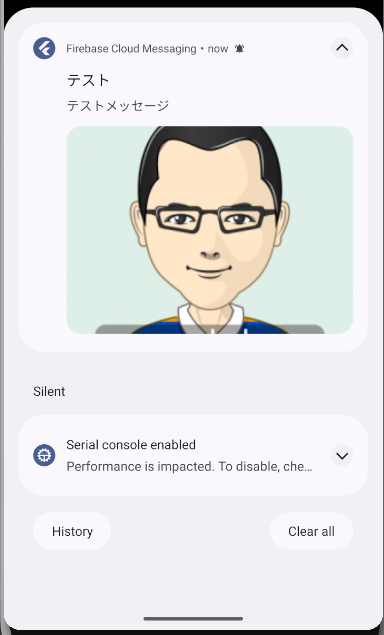

# Firebase Cloud Messaging

## 事前準備

Firebaseのサービスアカウントを取得して、`/src/main/resources/firebase-service-account.json`へ保存する。



## テストアプリ起動

```powershell
.\gradlew.bat clean bootRun
```

## テスト送信

`apis.http`のトークンをリプレースして、送信してください。


1. 送信要求をリクエストする。

    

2. Androidの通知画面

    

## 参照

1. [Using Firebase Cloud Messaging in Spring Boot Applications](https://www.baeldung.com/spring-fcm)
